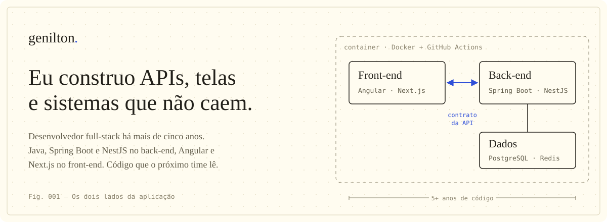

 

Sou desenvolvedor full-stack. Trabalho nos dois lados da aplicação: modelagem de dados, APIs e regras de negócio em **Java com Spring Boot** e **Node.js com NestJS**; interface, estado e performance em **Angular, React e Next.js**. Gosto da fronteira onde o contrato da API encontra o componente que consome ela — é ali que mora a maioria dos bugs.

 

 

  <a href="mailto:geniltonsilva2002@gmail.com">E-mail</a> ·
  <a href="https://www.linkedin.com/in/genilton-silva-974705204/">LinkedIn</a> ·
  <a href="https://g-silva.vercel.app/">Portfólio</a> ·
  <a href="https://g-silva.vercel.app/work">Projetos</a>

